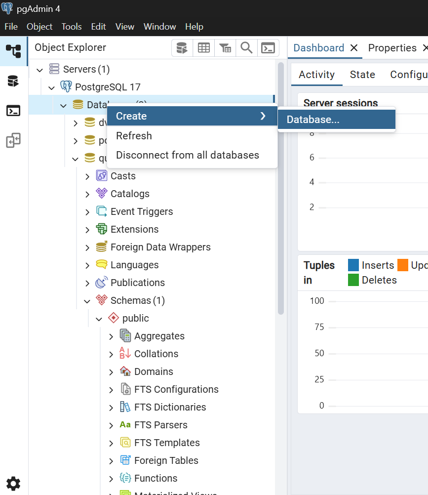
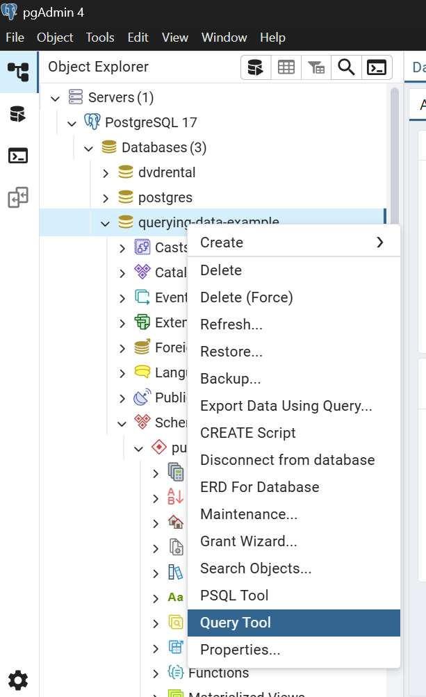

<h1 style="text-align: center; padding: 40px 2px">Querying Data in PostgreSQL</h1>
<p style="text-align: center; font-style: italic;">Learning SELECT, Aliases, ORDER BY, and DISTINCT with Lucy, Nathanael and Stella</p>


<h2 style="text-align: center; padding-top: 100px">Table of Contents</h2>

  1. [Introduction](#introduction)
  2. [Setup](#setup)
  3. [The Select Statement](#the-select-statement)
  4. [Column Aliases](#column-aliases)
  5. [ORDER BY Clause](#order-by-clause)
  6. [SELECT DISTINCT Clause](#select-distinct)
  7. [Querying Tips](#querying-tips)
  8. [PostgreSQL Querying Summary](#postgresql-querying-summary)

<h2 style="padding-top: 100px" id="introduction">Introduction</h2>

### Creating the 'sample_t2g' database
First, open the Command Prompt on Windows or Terminal on Unix-like systems and connect to the PostgreSQL server using psql tool:

```
psql -U postgres
```

It’ll prompt you to enter a password for the postgres user:

```
Password for user postgres:
```

After entering the password correctly, you will be connected to the PostgreSQL server.

The command prompt will look like this:
```
postgres=#
```

Second, create a new database called sample_t2g using CREATE DATABASE statement:
```
CREATE DATABASE sample_t2g;
```

Output:
```
CREATE DATABASE
```

PostgreSQL will create a new database called sample_t2g.

Third, verify the database creation using the \l command. The \l command will show all databases in the PostgreSQL server:

```
\l
```

Next, switch the current database to sample_t2g:
```
\c sample_t2g
```
The command prompt will change to the following:
```
sample_t2g=#
```

Now let's start...
We will cover essential querying techniques using the `employees` table:

```sql
CREATE TABLE employees (
  id SERIAL PRIMARY KEY,
  first_name VARCHAR(50),
  last_name VARCHAR(50),
  department VARCHAR(50),
  hire_date DATE,
  salary NUMERIC(10,2),
  email VARCHAR(100)
);

INSERT INTO employees VALUES
(1, 'Stella', 'Stephanie', 'Engineering', '2023-01-15', 89000, 's.stephanie@company.com'),
(2, 'Nathanael', 'Mutua', 'Marketing', '2022-03-22', 90000, 'nathanael.m@company.com'),
(3, 'Lucy', 'Wanjiru', 'Director', '2023-11-05', 92000, 'l.wanjiru@company.com'),
(4, 'Mwangi', 'Johnson', 'HR', '2021-08-30', 68000, 'mwangij@company.com'),
(5, 'Daniel', 'Njoroge', 'Engineering', '2023-01-15', 85000, 'dan.njoro@company.com'),
(6, 'Anna', 'Kiptoo', NULL, '2023-05-01', 75000, 'anna.kip@company.com'),
(7, 'Wilson', 'Kiptoo', 'Engineering', '2024-02-12', 85000, 'wilson.kip@company.com'),
(8, 'Mercy', 'Mumo', 'Marketing', '2024-02-12', 42000, 'mercy.mumo@company.com'),
(9, 'Michael', 'Kiptoo', NULL, '2023-07-01', 65000, 'anna.kip@company.com'),
(10, 'Johnson', 'Kiptoo', 'HR', '2025-03-01', 68000, 'johnson.kip@company.com');
```


<h2 style="padding-top: 60px" id="setup">Setup</h2>

### Requirements
- Have PostgreSQL installed..[click here for a tutorial](https://www.youtube.com/watch?v=GpqJzWCcQXY)
- Have PGADmin 4 installed...[click here for a tutorial](https://www.youtube.com/watch?v=4qH-7w5LZsA)
- Create a database (you can name it as you wish)



- Now we can start, just open the query tool:



- Create the employees table above, then let's jump right in.

<h2 style="padding-top: 100px" id="the-select-statement">1. The SELECT Statement</h2>

### What I will cover:
- [Basic Syntax](#basic-syntax)
- [Fetching Specific Columns](#fetch-specific-columns)
- [Selecting Multiple columns](#selecting-multiple-columns)
- [Fetching all columns](#fetch-all-columns)
- [Using Expressions](#using-expressions)

It is like the foundation of data retrieval in PostgreSQL.

It is a command for retrieving data from tables within a PostgreSQL database. It enables users to specify which columns to fetch and apply filters for targeted results.

### Basic Syntax
```sql
SELECT column1, column2, ...
FROM table_name;
```

### Key Examples
### Fetch specific columns
We specify the columns to be selected after the 'SELECT' keyword.

#### Selecting a single Column

```sql
SELECT first_name
FROM employees;
```
```
 first_name 
------------
 Stella    
 Nathanael
 Lucy
 Mwangi
 Daniel    
 ... --Means there's more in the Data Output
```

#### Selecting Multiple Columns
We separate each column with a comma (,). Allowing us to select more than one column for each query.
```sql
SELECT first_name, last_name, department 
FROM employees;
```
```
 first_name |  last_name  |   department  
------------+-------------+---------------
 Stella     | Stephanie  |  Engineering
 Nathanael  | Mutua      |  Marketing
 Lucy       | Wanjiru    |  Director
 ...
```

### Fetch all columns
We use the (*) asterisk symbol. This gives us all the columns from the table.
```sql
SELECT * FROM employees;
```
> **Avoid SELECT * in production:** Retrieves all columns which can:
> - Reduce database performance
> - Increase network traffic
> - Cause application slowdowns

### Using expressions
```sql
SELECT 
  first_name || ' ' || last_name,
  salary
FROM employees;
```
```
     ?column?     | salary 
------------------+----------
 Sarah Stephanie  |  89000.00
 Lucy Wanjiru     |  92000.00
 Nathanael Mutua  |  90000.00
 ...
```
> Notice the default column name. We'll learn to customize these with aliases in the next section.

### Using WHERE to target and filter

> This will be covered in detail later on

To filter results based on specific conditions, we can use the WHERE clause. For example, to retrieve employees in the Engineering department:

```sql
SELECT 
  first_name , last_name, salary
FROM employees
WHERE department = 'Engineering';
```
```
     first_name   |      last_name   | salary     |
------------------+------------------+------------+
 Stella           |  Stephanie       |  85000.00  |
 Daniel           |  Njoroge         |  85000.00  |
 ...
```

<h2 style="padding-top: 100px" id="column-aliases">2. Column Aliases</h2>

### What I will Cover:
- [Syntax Options](#syntax-options)
- [Basic Aliasing](#basic-aliasing)
- [Expression Aliasing](#expression-aliasing)
- [Aliasing with Special Characters](#aliases-with-special-characters)

These are temporary names assigned to columns or expressions for readability.

### Syntax Options
```sql
SELECT column_name AS alias_name
SELECT column_name alias_name  -- AS is optional
SELECT expression AS "Alias With Space"
```

### Examples of Aliasing
#### Basic aliasing
We will replace the column heads for two columns in our employees table.

```sql
SELECT 
  first_name AS "First Name", 
  last_name AS surname
FROM employees;
```
```
  First Name  |   surname   
--------------+--------------
 Stella       |   Stephanie
 Nathanael    |   Mutua
 Lucy         |   Wanjiru
 Mwangi       |   Johnson
 ...   
```

> To alias names with spaces we enclose them in double quotes

#### Expression aliasing
```sql
SELECT 
  first_name || ' ' || last_name AS full_name,
  salary * 1.1 AS proposed_salary
FROM employees;
```
```
   full_name       | proposed_salary 
-------------------+-----------------
 Stella Stephanie  |        97900.00
 Nathanael Mutua   |        99000.00
 ...
```

#### Aliases with special characters
As seen before we enclose word with spaces in double brackets in order to use them as aliases.

```sql
SELECT 
  email AS "Work Email",
  salary AS "Monthly Salary ($)"
FROM employees;
```

```
     Work Email            |   Monthly Salary
---------------------------+------------------- 
  s.stephanie@company.com	 |    89000.00
  nathanael.m@company.com	 |    90000.00
  l.wanjiru@company.com	   |    92000.00
  ...
```

<h2 style="padding-top: 100px" id="order-by-clause">3. ORDED BY Clause</h2>

### What I will cover
- [Basic Syntax](#basic-syntax-1)
- [Single Column Sorting](#single-column-sorting)
- [Multi-column Sorting](#multi-column-sorting)
- [Sorting By Expression](#sorting-by-expression)
- [NULL Handling](#null-handling)


Sorts query results based on specified columns or expressions.
Usually basically ascending and descending, but we can do more.

### Basic Syntax
```sql
SELECT columns
FROM table
ORDER BY column1 [ASC|DESC], 
         column2 [ASC|DESC];
```

### Sorting Techniques
#### Single column sorting
```sql
SELECT first_name, hire_date
FROM employees
ORDER BY hire_date DESC;  -- Newest first
```
```
 first_name  |  hire_date
-------------+-------------
  Johnson    |  2025-03-01
  Wilson     |  2024-02-12
  Mercy      |  2024-02-12
  Lucy       |  2023-11-05
  ...
```

#### Multi-column sorting
```sql
SELECT department, first_name, salary
FROM employees
ORDER BY department ASC, salary DESC;
```
```
   department  |  first_name  |  salary
---------------+--------------+-----------   
 Director	     |   Lucy	      |  92000.00
 Engineering	 |   Stella  	  |  89000.00
 ...
```
#### Sorting by expression
```sql
SELECT last_name, first_name
FROM employees
ORDER BY LENGTH(first_name), last_name;
```
```
   last_name   | 	first_name	|  
---------------+--------------|
  Anna    	   |  Kiptoo	    |
  Lucy         |	Wanjiru  	  |
 ...
```

#### NULL handling
In some tables we may come across null values, it helps that we can identify null values and sort our query according to their position.

First, we can ensure they appear last, in a situation wher we do not need to see the Null values.
```sql
SELECT first_name, department
FROM employees
ORDER BY department NULLS LAST;
```

```
   first_name  |  department
---------------+--------------
    Anna       |     [null]	 
  ...
```

Secondly, we can have them appearing at the top of the queried data. This will ensure we can identify them.
```sql
SELECT first_name, department
FROM employees
ORDER BY department NULLS FIRST;
```

```
   first_name  |  department
---------------+--------------
  ...
   Anna       |     [null]	 
```

<h2 style="padding-top: 100px" id="select-distinct">4. SELECT DISTINCT Clause</h2>

### What I will cover
- [Basic Syntax](#basic-syntax-2)
- [Single Column Distinct](#single-column-distinct)
- [Multi-column Distinct](#multi-column-distinct)
- [DISTINCT with Expressions](#distinct-with-expressions)

This is a clause that removes duplicate rows from query results.

### Basic Syntax
```sql
SELECT DISTINCT column1
FROM table_name;

SELECT DISTINCT column1, column2
FROM table_name;
```

### Duplicate Elimination
#### Single column distinct
We can start off by targeting a single column to remove duplicates.
```sql
SELECT DISTINCT department 
FROM employees;
```
```
 department  
--------------
 Engineering
 Marketing
 Director
 HR
 null
```

#### Multi-column distinct
Here we will select non-duplicates for more than one column.

In the example below:
We are checking for the unique values in ```department``` column, and ```salary``` column.

You will notice that we have some repeated departments, Don't Worry.
So, we first check for unique values in department, which are: ```Engineering```, ```Marketing```, ```Director```,```HR``` and ```null```.
Which will appear as we saw in the first query. But with the added ```salary``` column we also check for unique values in the column.

Let's take one department, say ```Engineering```, it has several members, but the unique salaries that do not duplicate are the only ones shown; this is the same to ```Marketing```.
```sql
SELECT DISTINCT department, salary
FROM employees;
```
```
 first_name  |  department  
-------------+--------------
 Marketing   |  42000.00
 [null]      |  75000.00
 HR          |  68000.00
 [null]      |  65000.00
 Engineering |  89000.00
 Engineering |  85000.00
 Director    |  92000.00
 ...
```

#### DISTINCT with expressions
```sql
SELECT DISTINCT 
  salary / 1000 AS salary_band
FROM employees;
```
```
 salary_band 
-------------
    92.00
    65.00
    68.00
    85.00
    75.00
    89.00
    ...
```
> **Performance thought:** DISTINCT sorts results internally which can be costly on large datasets.

<h2 style="padding-top: 100px" id="querying-tips">Querying Tips</h2>

> - **SELECT Specific Columns**: Avoid SELECT * in production, it's kinda risky.
> - **Use Aliases Wisely**: Improve readability but avoid names that are too long.
> - **DISTINCT Alternatives**: Consider GROUP BY for complex deduplication.

<h2 style="padding-top: 100px" id="postgresql-querying-summary">PostgreSQL Querying Summary</h2>

| Clause/Statement             | Purpose                          | Example                          |
|--------------------|----------------------------------|----------------------------------|
| SELECT             | Specify columns to retrieve      | SELECT id, name FROM users       |
| AS                 | Assign column alias              | SELECT salary * 12 AS annual     |
| ORDER BY           | Sort results                     | ORDER BY hire_date DESC          |
| DISTINCT           | Remove duplicates                | SELECT DISTINCT department       |
| NULLS FIRST/LAST   | Control NULL position in sorts   | ORDER BY score NULLS LAST        |

<p style="padding-top: 100px; font-weight: 700; text-align: center;">PostgreSQL Querying Tutorial - <i>Nash, Stella & Lucy</i></p>